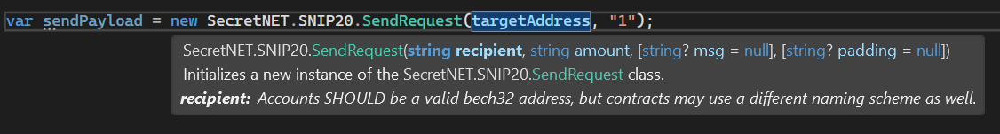

# Secret.NET Token (SNIP20) / Secret Token
**Secret.NET Token** is a layer on top of the [**Secret.NET client**](https://github.com/0xxCodemonkey/SecretNET) which supports all methods of the reference implementation of the SNIP20 contract.

**The [Secret Network blockchain](https://scrt.network/) (L1 / Cosmos), is the first privacy smart contract blockchain that processes and stores data on-chain in encrypted form (via Intel SGX).** 
This allows [unique use cases](https://docs.scrt.network/secret-network-documentation/secret-network-overview/use-cases) like Secret Token where you e.g., can hide balances and ownership of the token (optional).

**SecretNET.Token** provides typed and documented objects and methods that simplify interaction with a SNIP20 smart contract.  

- Implementation => [GitHub - scrtlabs/snip20-reference-impl](https://github.com/scrtlabs/snip20-reference-impl)
- Implementation of a [SNIP-20](https://github.com/SecretFoundation/SNIPs/blob/master/SNIP-20.md), [SNIP-21](https://github.com/SecretFoundation/SNIPs/blob/master/SNIP-21.md), [SNIP-22](https://github.com/SecretFoundation/SNIPs/blob/master/SNIP-22.md), [SNIP-23](https://github.com/SecretFoundation/SNIPs/blob/master/SNIP-23.md) and [SNIP-24](https://github.com/SecretFoundation/SNIPs/blob/master/SNIP-24.md) compliant token contract.
- See also the [SNIP20 documentation on Secret Network](https://docs.scrt.network/secret-network-documentation/development/snips/snip-20-spec-private-fungible-tokens).

:white_check_mark: **This repository is explicitly intended to serve as a template for custom SNIP20 token contracts.** 
This makes it easy to create your own customized clients for your own customized contracts.
**Of course, the concept can be used for any kind of smart contracts in general**.

## Full API-documentation
You can find the **full API-documentation** here => https://0xxcodemonkey.github.io/SecretNET.Token

# Table of Contents
- [Table of Contents](#table-of-contents)
- [Implementation](#implementation)
  - [Instantiating a SNIP20 Client](#instantiating-a-snip20-client)
  - [Usage](#usage)
- [Implemented methods](#implemented-methods)
  - [Queries](#queries)
  - [Transactions](#transactions)


# Implementation
The structure of **SecretNET.Token** is the same as the **SecretNET** client and transactions are accessible via ```Tx``` property and queries via ```Query``` property.

All transactions can also be simulated via ```Tx.Simulate```.

**All types and methods are documented and eases programming:**



## Instantiating a SNIP20 Client
To instantiate a **SecretNET.Token** client you just have to pass it a [SecretNET client instance](https://github.com/0xxCodemonkey/SecretNET#usage-examples):

```  csharp
var snip20Client =  new SecretNET.Token.Snip20Client(secretNetworkClient);
```
## Usage
All Methods can be easily called with the payload message like this:

```  csharp
var payloadSendMsg = new SecretNET.Token.SendRequest(recipientAddress, "1");
var sendMsg = new SecretNET.Token.MsgSend(
              payloadSendMsg, 
              snip20ContractAddress, 
              snip20CodeHash);
              
var sendResult = await snip20Client.Tx.Send(sendMsg, txOptions: txOptionsExecute);
```
Many methods also have an overload to make them even easier to call, like this

``` csharp
var sendResult = await snip20Client.Tx.Send(
              snip20ContractAddress, 
              recipientAddress, 
              "1", 
              codeHash: snip20CodeHash, 
              txOptions: txOptionsExecute);
```
# Implemented methods
- [Queries](#queries)
  - [GetAllowance](#getallowance)
  - [GetBalance](#getbalance)
  - [GetExchangeRate](#getexchangerate)
  - [GetMinters](#getminters)
  - [GetTokenInfo](#gettokeninfo)
  - [GetTransferHistory](#gettransferhistory)
- [Transactions](#transactions)
  - [Burn](#burn)
  - [BurnFrom](#burnfrom)
  - [SetViewingKey](#setviewingkey)
  - [CreateViewingKey](#createviewingkey)
  - [DecreaseAllowance](#decreaseallowance)
  - [Deposit](#deposit)
  - [IncreaseAllowance](#increaseallowance)
  - [Instantiate (token contract)](#instantiate-token-contract)
  - [Mint](#mint)
  - [Redeem](#redeem)
  - [RegisterReceive](#registerreceive)
  - [Send](#send)
  - [SendFrom](#sendfrom)
  - [SetMinters](#setminters)  
  - [Transfer](#transfer)
  - [TransferFrom](#transferfrom)
 
## Queries
### [GetAllowance](https://0xxcodemonkey.github.io/SecretNET.Token/html/M-SecretNET.Token.Snip20Querier.GetAllowance.htm)
Gets the allowance (This query MUST be authenticated). This returns the available allowance that spender can access from the owner's account, along with the expiration info. Every account's viewing key MUST be given permissions to query the allowance of any pair of owner and spender, as long as that account is either the owner or the spender in the query. In other words, every account's viewing key can be used to find out how much allowance the account has given other accounts, and how much it has been given by other accounts. The expiration field of the response may be either null or unset if no expiration has been set.
``` csharp
GetAllowance(
	string contractAddress,
	string ownerAddress,
	string spenderAddress,
	Nullable<string> viewingKey,
	Nullable<Permit> permit,
	Nullable<string> codeHash
);
```
### [GetBalance](https://0xxcodemonkey.github.io/SecretNET.Token/html/M-SecretNET.Token.Snip20Querier.GetBalance.htm)
Gets the balance (This query MUST be authenticated). Returns the balance of the given address. Returns "0" if the address is unknown to the contract.
``` csharp
GetBalance(
	string contractAddress,
	Nullable<string> walletAddress,
	Nullable<string> viewingKey,
	Nullable<Permit> permit,
	Nullable<string> codeHash
);
```
### [GetExchangeRate](https://0xxcodemonkey.github.io/SecretNET.Token/html/M-SecretNET.Token.Snip20Querier.GetExchangeRate.htm)
Gets information about the token exchange rate functionality that the contract provides (This query need not be authenticated). This query MUST return. - exchange rate, as an integer string. The amount of native coins that equal one token. - Denomination of native tokens which are acceptable, as a string OR a comma separated value.
``` csharp
GetExchangeRate(
	string contractAddress,
	Nullable<string> codeHash
);
```
### [GetMinters](https://0xxcodemonkey.github.io/SecretNET.Token/html/M-SecretNET.Token.Snip20Querier.GetMinters.htm)
Returns the list of minters that have been configured in the contract (This query need not be authenticated).
``` csharp
GetMinters(
	string contractAddress,
	Nullable<string> codeHash
);
```
### [GetTokenInfo](https://0xxcodemonkey.github.io/SecretNET.Token/html/M-SecretNET.Token.Snip20Querier.GetTokenInfo.htm)
Gets the token information (This query need not be authenticated). Returns the token info of the contract. The response MUST contain: token name, token symbol, and the number of decimals the token uses. The response MAY additionally contain the total-supply of tokens. This is to enable Layer-2 tokens which want to hide the amounts converted as well.
``` csharp
GetTokenInfo(
	string contractAddress,
	Nullable<string> codeHash
);
```
### [GetTransferHistory](https://0xxcodemonkey.github.io/SecretNET.Token/html/M-SecretNET.Token.Snip20Querier.GetTransferHistory.htm)
Gets the transfer history (This query MUST be authenticated). This query SHOULD return a list of json objects describing the transactions made by the querying address, in newest-first order. The user may optionally specify a limit on the amount of information returned by paging the available items.
``` csharp
GetTransferHistory(
	string contractAddress,
	int pageSize,
	Nullable<int> page,
	Nullable<string> walletAddress,
	Nullable<string> viewingKey,
	Nullable<Permit> permit,
	Nullable<string> codeHash
);
```

## Transactions
### [Burn](https://0xxcodemonkey.github.io/SecretNET.Token/html/M-SecretNET.Token.Snip20Tx.Burn_1.htm)
MUST remove amount tokens from the balance of the Cosmos message sender and MUST reduce the total supply by the same amount. MUST NOT transfer the funds to another account.
``` csharp
Burn(
	MsgBurn msg,
	Nullable<TxOptions> txOptions
);

Burn(
	string contractAddress,
	string amount,
	Nullable<string> padding,
	Nullable<string> codeHash,
	Nullable<TxOptions> txOptions
);
```
### [BurnFrom](https://0xxcodemonkey.github.io/SecretNET.Token/html/M-SecretNET.Token.Snip20Tx.Burn_1.htm)
This works like TransferFrom, but burns the tokens instead of transferring them. This will reduce the owner's balance, total_supply and the caller's allowance. This function should be available when a contract supports both the Mintable and Allowances interfaces.
``` csharp
BurnFrom(
	MsgBurnFrom msg,
	Nullable<TxOptions> txOptions
);

BurnFrom(
	string contractAddress,
	string owner,
	string amount,
	Nullable<string> padding,
	Nullable<string> codeHash,
	Nullable<TxOptions> txOptions
);
```
### [SetViewingKey](https://0xxcodemonkey.github.io/SecretNET.Token/html/M-SecretNET.Token.Snip20Tx.SetViewingKey_1.htm)
Set a viewing key with a predefined value for Cosmos message sender, without creating it. This is useful to manage multiple SNIP-20 tokens using the same viewing key. If a viewing key is already set, the contract MUST replace the current key.If a viewing key is not set, the contract MUST set the provided key as the viewing key. It is NOT RECOMMENDED to use this function to create easy to remember passwords for users, but this is left up to implementors to enforce.
``` csharp
SetViewingKey(
	MsgSetViewingKey msg,
	Nullable<TxOptions> txOptions
);

SetViewingKey(
	string contractAddress,
	string viewingKey,
	Nullable<string> padding,
	Nullable<string> codeHash,
	Nullable<TxOptions> txOptions
);
```
### [CreateViewingKey](https://0xxcodemonkey.github.io/SecretNET.Token/html/M-SecretNET.Token.Snip20Tx.CreateViewingKey_1.htm)
This function generates a new viewing key for the Cosmos message sender, which is used in ALL account specific queries. This key is used to validate the identity of the caller, since in queries in Cosmos there is no way to cryptographically authenticate the querier's identity. 

The entropy field of the request should be a client supplied string used for entropy for generation of the viewing key. Secure implementation is left to the client, but it is recommended to use base-64 encoded random bytes and not predictable inputs.
``` csharp
CreateViewingKey(
	MsgCreateViewingKey msg,
	Nullable<TxOptions> txOptions
);

CreateViewingKey(
	string contractAddress,
	string entropy,
	Nullable<string> padding,
	Nullable<string> codeHash,
	Nullable<TxOptions> txOptions
);
```
### [DecreaseAllowance](https://0xxcodemonkey.github.io/SecretNET.Token/html/M-SecretNET.Token.Snip20Tx.DecreaseAllowance_1.htm)
ecrease or clear the allowance by a sent amount. This may optionally come with an expiration time, which if set limits when the approval can be used. If amount is equal or greater than the current allowance, this action MUST set the allowance to zero, and return a "success" response.
``` csharp
DecreaseAllowance(
	MsgDecreaseAllowance msg,
	Nullable<TxOptions> txOptions
);

DecreaseAllowance(
	string contractAddress,
	string spender,
	string amount,
	Nullable<int> expiration,
	Nullable<string> padding,
	Nullable<string> codeHash,
	Nullable<TxOptions> txOptions
);
```
### [Deposit](https://0xxcodemonkey.github.io/SecretNET.Token/html/M-SecretNET.Token.Snip20Tx.Deposit_1.htm)
Deposits a native coin into the contract, which will mint an equivalent amount of tokens to be created. The amount MUST be sent in the sent_funds field of the transaction itself, as coins must really be sent to the contract's native address. 

The minted amounts MUST match the exchange rate specified by the ExchangeRate query. The deposit MUST return an error if any coins that do not match expected denominations are sent.
``` csharp
Deposit(
	MsgDeposit msg,
	Nullable<TxOptions> txOptions
);

Deposit(
	string contractAddress,
	Coin[] sentFunds,
	Nullable<string> padding,
	Nullable<string> codeHash,
	Nullable<TxOptions> txOptions
);
```
### [IncreaseAllowance](https://0xxcodemonkey.github.io/SecretNET.Token/html/M-SecretNET.Token.Snip20Tx.IncreaseAllowance_1.htm)
Set or increase the allowance such that spender may access up to current_allowance + amount tokens from the Cosmos message sender account. This may optionally come with an expiration time, which if set limits when the approval can be used (by time).
``` csharp
IncreaseAllowance(
	MsgIncreaseAllowance msg,
	Nullable<TxOptions> txOptions
);

IncreaseAllowance(
	string contractAddress,
	string spender,
	string amount,
	Nullable<int> expiration,
	Nullable<string> padding,
	Nullable<string> codeHash,
	Nullable<TxOptions> txOptions
);
```
### [Instantiate (token contract)](https://0xxcodemonkey.github.io/SecretNET.Token/html/M-SecretNET.Token.Snip20Tx.Instantiate.htm)
nstantiates / configures the Token contract (https://github.com/SecretFoundation/SNIPs/blob/master/SNIP-20.md at 2022-07-11).
``` csharp
Instantiate(
	MsgInstantiate msg,
	Nullable<TxOptions> txOptions
);
```
### [Mint](https://0xxcodemonkey.github.io/SecretNET.Token/html/M-SecretNET.Token.Snip20Tx.Mint_1.htm)
This function MUST be allowed only for accounts on the minters list. If the Cosmos message sender is an allowed minter, this will create amount new tokens and add them to the balance of recipient.
``` csharp
Mint(
	MsgMint msg,
	Nullable<TxOptions> txOptions
);

Mint(
	string contractAddress,
	string recipient,
	string amount,
	Nullable<string> padding,
	Nullable<string> codeHash,
	Nullable<TxOptions> txOptions
);
```
### [Redeem](https://0xxcodemonkey.github.io/SecretNET.Token/html/M-SecretNET.Token.Snip20Tx.Redeem_1.htm)
Redeems tokens in exchange for native coins. The redeemed tokens SHOULD be burned, and taken out of the pool.
``` csharp
Redeem(
	MsgRedeem msg,
	Nullable<TxOptions> txOptions
);

Redeem(
	string contractAddress,
	string amount,
	Nullable<string> denom,
	Nullable<string> padding,
	Nullable<string> codeHash,
	Nullable<TxOptions> txOptions
);
```
### [RegisterReceive](https://0xxcodemonkey.github.io/SecretNET.Token/html/M-SecretNET.Token.Snip20Tx.RegisterReceive_1.htm)
This message is used to tell the SNIP-20 contract to call the Receive function of the Cosmos message sender after a successful Send. In Secret Network this is used to pair a code hash with the contract address that must be called. This means that the SNIP-20 MUST store the sent code_hash and use it when calling the Receive function.
``` csharp
RegisterReceive(
	MsgRegisterReceive msg,
	Nullable<TxOptions> txOptions
);

RegisterReceive(
	string contractAddress,
	string receiverCodeHash,
	Nullable<string> padding,
	Nullable<string> codeHash,
	Nullable<TxOptions> txOptions
);
```
### [Send](https://0xxcodemonkey.github.io/SecretNET.Token/html/M-SecretNET.Token.Snip20Tx.Send_1.htm)
Moves amount from the Cosmos message sender account to the recipient account. The receiver account MAY be a contract that has registered itself using a RegisterReceive message. If such a registration has been performed, a message MUST be sent to the contract's address as a callback, after completing the transfer. The format of this message is described under Receiver interface. If the callback fails due to an error in the Receiver contract, the entire transaction will be reverted.
``` csharp
Send(
	MsgSend msg,
	Nullable<TxOptions> txOptions
);

Send(
	string contractAddress,
	string recipient,
	string amount,
	Nullable<string> message,
	Nullable<string> padding,
	Nullable<string> codeHash,
	Nullable<TxOptions> txOptions
);
```
### [SendFrom](https://0xxcodemonkey.github.io/SecretNET.Token/html/M-SecretNET.Token.Snip20Tx.SendFrom_1.htm)
SendFrom is to Send, what TransferFrom is to Transfer. This allows a pre-approved account to not just transfer the tokens, but to send them to another address to trigger a given action. Note SendFrom will set the Receive{sender} to be the env.message.sender (the account that triggered the transfer) rather than the owner account (the account the money is coming from).
``` csharp
SendFrom(
	MsgSendFrom msg,
	Nullable<TxOptions> txOptions
);

SendFrom(
	string contractAddress,
	string owner,
	string recipient,
	string amount,
	Nullable<string> message,
	Nullable<string> padding,
	Nullable<string> codeHash,
	Nullable<TxOptions> txOptions
);
```
### [SetMinters](https://0xxcodemonkey.github.io/SecretNET.Token/html/M-SecretNET.Token.Snip20Tx.SetMinters_1.htm)
This function MUST only be allowed for authorized accounts. The list of addresses in the message will be set to the list of minters in the contract. This completely overrides the previously saved list.
``` csharp
SetMinters(
	MsgSetMinters msg,
	Nullable<TxOptions> txOptions
);

SetMinters(
	string contractAddress,
	string minterAddress,
	Nullable<string> padding,
	Nullable<string> codeHash,
	Nullable<TxOptions> txOptions
);
```
### [Transfer](https://0xxcodemonkey.github.io/SecretNET.Token/html/M-SecretNET.Token.Snip20Tx.Transfer_1.htm)
Moves tokens from the account that appears in the Cosmos message sender field to the account in the recipient field. Variation from CW-20: It is NOT required to validate that the recipient is an address and not a contract. This command will work when trying to send funds to contract accounts as well.
``` csharp
Transfer(
	MsgTransfer msg,
	Nullable<TxOptions> txOptions
);

Transfer(
	string contractAddress,
	string recipient,
	string amount,
	Nullable<string> padding,
	Nullable<string> codeHash,
	Nullable<TxOptions> txOptions
);
```
### [TransferFrom](https://0xxcodemonkey.github.io/SecretNET.Token/html/M-SecretNET.Token.Snip20Tx.TransferFrom_1.htm)
Transfer an amount of tokens from a specified account, to another specified account. This action MUST fail if the Cosmos message sender does not have an allowance limit that is equal or greater than the amount of tokens sent for the owner account.
``` csharp
TransferFrom(
	MsgTransferFrom msg,
	Nullable<TxOptions> txOptions
);

TransferFrom(
	string contractAddress,
	string owner,
	string recipient,
	string amount,
	Nullable<string> padding,
	Nullable<string> codeHash,
	Nullable<TxOptions> txOptions
);
```
